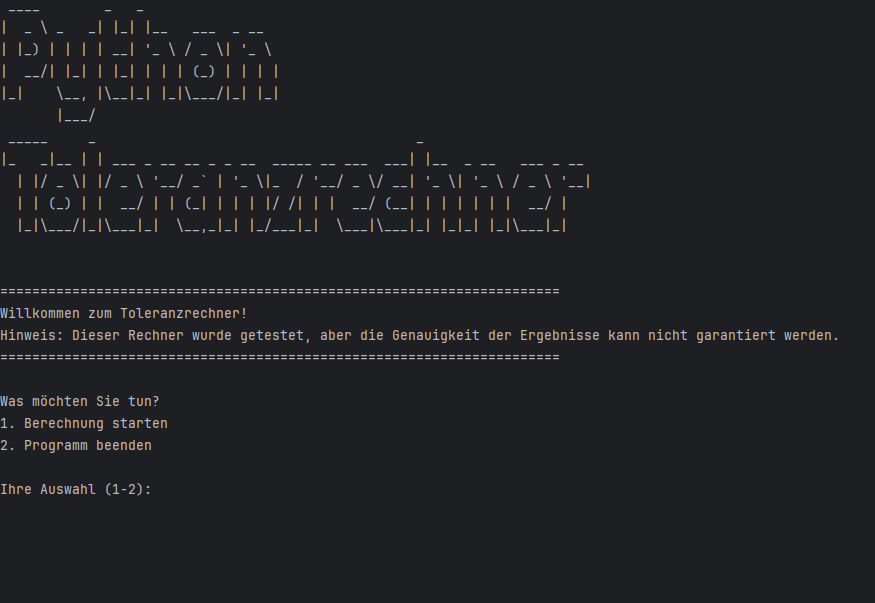
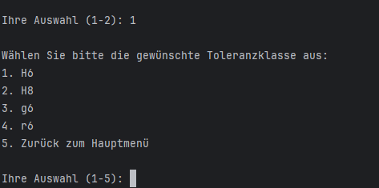
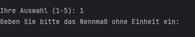
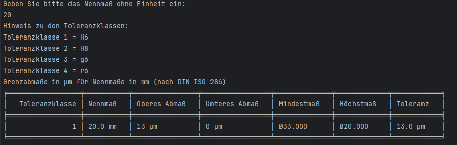
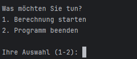
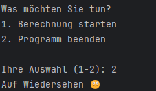
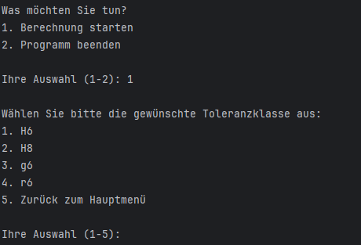

# Toleranzrechner
Welcome to the Toleranzrechner! This is an interactive application designed to help mechanical engineering students, mechatronics engineers, manufacturing professionals, and design engineers who work with machining and precision component design. 
The calculations are based on the standard **DIN ISO 286**, ensuring accurate and standardized results for limit dimensions in technical drawings.
## 🔍 Overview
The Python Toleranzrechner is a Python-based application that allows users to input different nominal dimensions within a range of 1-30 mm and provides outputs such as the upper deviation, lower deviation, maximum limit, minimum limit, and the tolerance range.The application provides the results based on user input and allows them to continue or exit after each calculation.

## ✨ Features
<ul>
  <li>Interactive Calculator: Users can select from different tolerance classes (<strong>H6, H8, g6, r6</strong>).</li>
  <li>Feedback: After choosing the tolerance class, users are required to input a nominal dimension so that the results can be displayed.</li>
  <li>Easy Navigation: Users can choose to return to the main menu or exit the game.</li>
</ul>

## 🔧 Installation
### Prerequisites
<ul>
  <li>Python 3.x installed on your system.</li>
  <li>Basic knowledge of how to run Python scripts.</li>
</ul>

### Steps to install
<ol>
  <li>Clone the Repository</li>
  <ul>
    <li>git clone <a href="https://github.com/Abdurrahmaan-Bica/toleranzrechner.git">https://github.com/Abdurrahmaan-Bica/toleranzrechner.git</a></li>
    <li>cd toleranzrechner (<strong>project directory</strong>)</li>
  </ul>
   
   <li>Ensure Python Environment</li>
   <ul>
    <li>You can verify this by running: <strong>python --version</strong></li>
  </ul>
   
  <li>Navigate to Project Directory</li>
   <ul>
    <li>Change to the directory where the <strong>main.py</strong> is located.</li>
  </ul>
   
  <li>Run the Application</li>
   <ul>
    <li>Execute the following command to start the calculator: <strong>python main.py</strong></li>
  </ul>
</ol>

## 🚀Usage
### Running the Calculator
<ol>
  <li>Start the Calculator</li>
  <ul>
    <li>Run the main.py using Python. The application will prompt you to select an option.</li>
     
    </img>
    
  </ul>
   
  <li>Select a Tolerance Class</li>
  <ul>
    <li>You will be presented with a list of options. Choose a number corresponding to the class you would like to perform calculations.</li>
     
    </img>
  </ul>
   
  <li>Input the Nominal Dimension</li>
  <ul>
    <li>After your Input, you will be able to see the results.</li>
     
    </img>
  </ul>
   
  <li>Review Results</li>
  <ul>
    <li>After your Input, the results will be displayed in a table.</li>
     
    </img>
  </ul>
   
   <li>Continue or Exit</li>
  <ul>
    <li>You will have the option to start a calculation or exit the program.</li>
     
    </img>
     
    <li>If exit is selected, a message is displayed.</li>
     
    </img>
     
    <li>Otherwise it returns to the main menu and the program starts all over again.</li>
     
    </img>
     
    
  </ul>
   
  
</ol>

## 📂 File Structure
<ul>
  <li>
    <strong>main.py</strong>: The main script that runs program. Handles user input, displays menu options, and provides feedback.Provides functions that perform calculations and display results.
  </li>
</ul>

## 🤝 Contributing
<ul>
  Contributions to the <strong>Python Toleranzrechner</strong> are welcome! If you'd like to contribute, please follow these guidelines:
   
  <li>
    Fork the Repository: Create your own fork of the repository.
  </li>
  <li>
  Clone Your Fork: Clone the forked repository to your local machine.
  </li>
  <li>
  Create a Branch: Create a new branch for your changes.
  </li>
  <li>
  Make Your Changes: Implement your changes or improvements.
  </li>
  <li>
  Test Your Changes: Ensure your changes work as expected and do not introduce bugs.
  </li>
  <li>
  Submit a Pull Request: Push your changes to your fork and submit a pull request to the original repository
  </li>
</ul>

## 🧪 Testing
To verify that each function in main.py behaves as expected, tests were conducted.
### Testing Functions in main.py:
<ul>
    <li><strong>haupt_menu_anzeigen():</strong></li>
    
Tested with different inputs, including options that are not listed. Ensured it correctly handles invalid inputs and shows the exception correct message for each input.

     
    <li><strong>toleranz_menu_anzeigen():</strong></li>
    
Tested with valid and invalid inputs. Ensured it goes do the main menu if the user chooses 5.

     
    <li><strong>nennmass_ueberpruefen(nennmass):</strong></li>
    <li><strong>tabelle_anzeigen(toleranzklasse,nennmass,oberes_abmass,unteres_abmass,formatiertes_hoechstmass,formatiertes_mindestmass,toleranz):</strong></li>
    <li><strong>masse_und_toleranz_berechnen(nennmass, toleranzklasse):</strong></li>

</ul>

## 🛠️ Deployment
I deployed the Toleranzrechner using Heroku’s dashboard, which offers an intuitive interface for deploying web applications. Here’s the process I followed:
<ul>
    <li>
        Logged into Heroku: I accessed my Heroku account and went to the dashboard. I created a new app and then provided a unique name for the app and chose the appropriate region.
    </li>
</ul>

